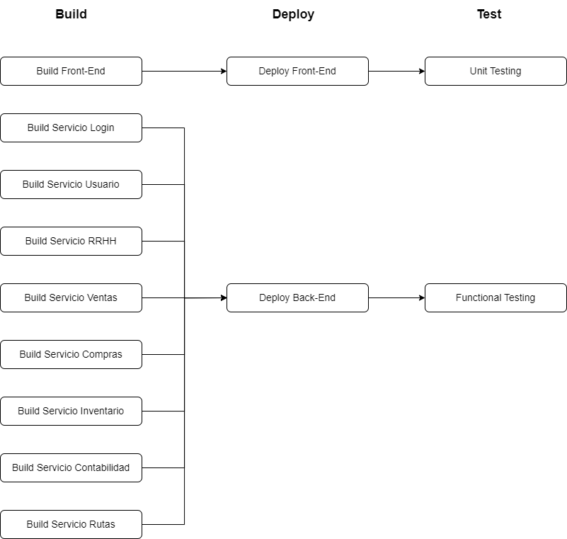

# Planificación de Pipelines

## Descripción
### Build
Para esta estapa, se creará una imagen por cada uno de los servicios, para su más fácil mantenimiento. Cada imagen generará un contenedor en docker que permitirá realizar la construcción de la imagen de cada servicio.  A su vez, se tendrá el build del front-end que contendrá el proyecto en angular de la interfaz de usuario.
### Deploy
En este apartado sólo se contará con dos estados, uno que permita alojar el front-end o el lado del cliente y el otro que permitirá alojar todos los servicios el back-end.

### Testing
Para esta etapa se tendrá dos tipos de pruebas funcionales y unitarias que permitan realizar pruebas a las funciones realizadas dentro de cada servicio. Las pruebas funcionales serán para el lado del servidor y las pruebas unitarias serán para el lado del cliente.

### [Regresar al índice](/README.md)