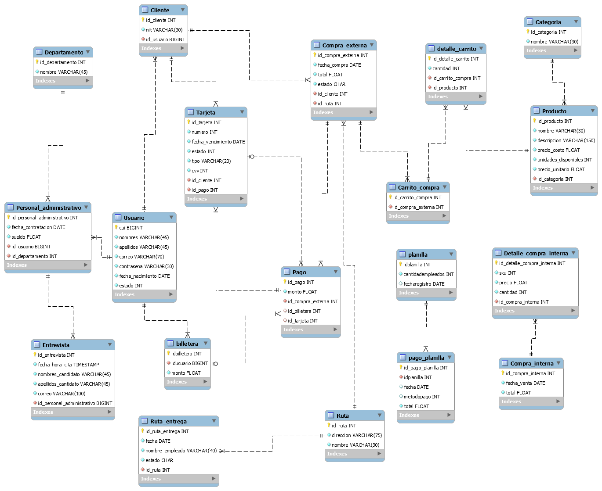

# [SA] PROYECTO FASE 3

**Software Avanzado, sección N**
**GRUPO 0914**

| Carnet    | Nombre                           | Porcentaje de trabajo |
|-----------|----------------------------------|-----------------------|
| 201314826 | Rafael Angel Chocoj Xinico       | 100%                  |
| 201531166 | Maynor Octavio Piló Tuy          | 100%                  |
| 201800984 | Alex Fernando Méndez López       | 100%                  |
| 201801329 | Mynor Rene Ruiz Guerra           | 100%                  |
| 201906564 | Lourdes Rosario Velásquez Melini | 100%                  |

## Documentación de las fases anteriores.

| Documentación                     |
|-----------------------------------|
| [Fase 1](./docs/fase 1/README.md) |
| [Fase 2](./docs/fase 2/README.md) |

## Bitácora de la metodología

### Daily

| No. | Documento                            | Fecha      |
|-----|--------------------------------------|------------|
| 1.  | [Daily 1](./docs/fase 3/Daily1.md)   | 18/03/2023 |
| 2.  | [Daily 2](./docs/fase 3/Daily2.md)   | 19/03/2023 |
| 3.  | [Daily 3](./docs/fase 3/Daily3.md)   | 20/03/2023 |
| 4.  | [Daily 4](./docs/fase 3/Daily4.md)   | 21/03/2023 |
| 5.  | [Daily 5](./docs/fase 3/Daily5.md)   | 22/03/2023 |
| 6.  | [Daily 6](./docs/fase 3/Daily6.md)   | 23/03/2023 |
| 7.  | [Daily 7](./docs/fase 3/Daily7.md)   | 24/03/2023 |
| 8.  | [Daily 8](./docs/fase 3/Daily8.md)   | 25/03/2023 |
| 9.  | [Daily 9](./docs/fase 3/Daily9.md)   | 26/03/2023 |
| 10. | [Daily 10](./docs/fase 3/Daily10.md) | 27/03/2023 |
| 11. | [Daily 11](./docs/fase 3/Daily11.md) | 28/03/2023 |
| 12. | [Daily 12](./docs/fase 3/Daily12.md) | 29/03/2023 |
| 13. | [Daily 13](./docs/fase 3/Daily13.md) | 30/03/2023 |


### Sprint Planning

| No. | Documento                                             |
|-----|-------------------------------------------------------|
| 1.  | [Sprint Planning 2](./docs/fase 3/SprintPlanning2.md) |

### Documentación Sprint

| No. | Documento                            | Fecha |
|-----|--------------------------------------|-------|
| 1.  | [Sprint 1](./docs/fase 3/Sprint1.md) |       |

## Contratos
[Contratos Fase 3](./docs/fase 3/Contratos.md)
[Contratos Fase 3](./docs/fase 3/contratos.pdf)

## Documentación Diagrama de gantt

[Fase 1](https://docs.google.com/spreadsheets/d/1LPSRup6pxLWEK_ljbOwfSeZkw-Gle2dNxiwm2aMZJO8/edit?usp=share_link) 

## Base de datos

### Diagrama ER



### Script de la base de datos

```sql


CREATE TABLE Ruta (
  id_ruta SERIAL PRIMARY KEY,
  zonas VARCHAR(50) NOT NULL, --numeros enteros separados por coma 
  nombre VARCHAR(30) NOT NULL 
);

CREATE TABLE Ruta_entrega	 (
  id_ruta_entrega SERIAL PRIMARY KEY,
  fecha DATE NOT NULL,
  nombre_empleado VARCHAR(40) NOT NULL,
  estado CHAR default 'P' NOT NULL, -- P = pedido, E = entregado
  id_ruta INTEGER NOT NULL REFERENCES Ruta(id_ruta)
);

CREATE TABLE Categoria (
  id_categoria SERIAL PRIMARY KEY,
  nombre VARCHAR(30) NOT NULL 
);

CREATE TABLE Departamento (
  id_departamento SERIAL PRIMARY KEY,
  nombre VARCHAR(45) NOT NULL
);


CREATE TABLE Usuario (
  cui BIGINT NOT NULL PRIMARY KEY,
  nombres VARCHAR(45) NOT NULL,
  apellidos VARCHAR(45) NOT NULL,
  correo VARCHAR(70) NOT NULL,
  contrasena VARCHAR(40) NOT NULL,
  fecha_nacimiento DATE NOT NULL,
  tipo CHAR default 'C' NOT NULL, -- C = Usuario cliente, E = Usuario empresarial, A = Usuario administrativo
  numero_grupo INT,
  seccion_grupo CHAR, -- seccion N o A 
  estado INTEGER NOT NULL -- Si el cliente esta 1 = activo ó 0 = dado de baja
);

CREATE TABLE Compra_interna (
  id_compra_interna SERIAL PRIMARY KEY,
  fecha_venta DATE NOT NULL,
  numero_grupo INT,
  seccion_grupo CHAR, -- seccion N o A 
  total FLOAT NOT NULL
);

CREATE TABLE Detalle_compra_interna (
  id_detalle_compra_interna SERIAL PRIMARY KEY,
  sku INTEGER NOT NULL,
  precio FLOAT NOT NULL,
  cantidad INTEGER NOT NULL,
  id_compra_interna INTEGER NOT NULL REFERENCES Compra_interna(id_compra_interna)
);

CREATE TABLE Personal_administrativo (
  id_personal_administrativo SERIAL PRIMARY KEY,
  fecha_contratacion DATE NOT NULL,
  sueldo FLOAT NOT NULL,
  id_usuario BIGINT NOT NULL REFERENCES Usuario(cui),
  id_departamento INTEGER NOT NULL REFERENCES Departamento (id_departamento)
);

CREATE TABLE Producto (
  sku BIGINT NOT NULL PRIMARY KEY,
  nombre VARCHAR (30) NOT NULL,
  descripcion VARCHAR (150) NOT NULL,
  precio_costo FLOAT NOT NULL,
  imagen VARCHAR(200),
  unidades_disponibles INTEGER NOT NULL,
  precio_unitario FLOAT NOT NULL,
  id_categoria INTEGER NOT NULL REFERENCES Categoria(id_categoria)
);

CREATE TABLE detalle_carrito (
  id_detalle_carrito SERIAL PRIMARY KEY,
  cantidad INTEGER NOT NULL,
  id_usuario BIGINT NOT NULL REFERENCES Usuario(cui),  
  estado CHAR default 'P' NOT NULL, -- P = Pendiente, C = Cancelada, A = aprobada, E = Entregado
  id_producto INTEGER NOT NULL REFERENCES Producto(sku),
  id_ruta INTEGER REFERENCES Ruta(id_ruta),
  id_venta INTEGER REFERENCES venta(id_venta)
);

CREATE TABLE Entrevista (
  id_entrevista SERIAL PRIMARY KEY,
  fecha_hora_cita TIMESTAMP  NOT NULL,
  nombres_candidato VARCHAR(45) NOT NULL,
  apellidos_cantidato VARCHAR(45) NOT NULL,
  correo VARCHAR(100) NOT NULL,
  id_personal_administrativo BIGINT NOT NULL REFERENCES Personal_administrativo(id_personal_administrativo)
);	

CREATE TABLE planilla (
	id_planilla serial4 NOT NULL,
	cantidadempleados int4 NOT NULL,
	fecharegistro date NULL,
	CONSTRAINT planilla_pkey PRIMARY KEY (id_planilla)
);

CREATE TABLE pago_planilla (
	id_pago_planilla serial4 NOT NULL,
	id_planilla int4 NOT NULL,
	fecha date NULL,
	metodo_pago int4 NULL,
	total float8 NOT NULL,
	CONSTRAINT pago_planilla_pkey PRIMARY KEY (id_pago_planilla),
	CONSTRAINT pago_planilla_id_planilla_fkey FOREIGN KEY (id_planilla) REFERENCES planilla(id_planilla)
);

CREATE TABLE billetera (
	id_billetera serial4 NOT NULL,
	id_usuario int4 NOT NULL,
	monto float8 NOT NULL DEFAULT 0,
	CONSTRAINT billetera_pkey PRIMARY KEY (id_billetera),
	CONSTRAINT billetera_id_usuario_fkey FOREIGN KEY (id_usuario) REFERENCES Usuario(cui)
);


CREATE TABLE Tarjeta (
  id_tarjeta SERIAL PRIMARY KEY,
  numero INTEGER NOT NULL,
  fecha_vencimiento DATE NOT NULL,
  estado INTEGER NOT NULL,
  tipo VARCHAR(20) NOT NULL,
  cvv INTEGER NOT NULL,
  id_usuario INTEGER NOT NULL REFERENCES Usuario(cui)
);


CREATE TABLE pago (
	id_pago serial4 NOT NULL,
	montowallet float8 NULL,
	id_detalle_carrito int4 NOT NULL,
	id_billetera int4 NULL,
	id_tarjeta int4 NULL,
	montotarjeta float8 NULL,
	tipopago int4 NOT NULL,
	CONSTRAINT pago_pkey PRIMARY KEY (id_pago),
	CONSTRAINT pago_id_billetera_fkey FOREIGN KEY (id_billetera) REFERENCES billetera(id_billetera),
	CONSTRAINT pago_id_detalle_carrito_fkey FOREIGN KEY (id_detalle_carrito) REFERENCES detalle_carrito(id_detalle_carrito),
	CONSTRAINT pago_id_tarjeta_fkey FOREIGN KEY (id_tarjeta) REFERENCES tarjeta(id_tarjeta)
);	


CREATE TABLE venta(
 id_venta SERIAL PRIMARY KEY,
 fecha TIMESTAMP NOT NULL,
 pago TIMESTAMP  NOT NULL,
 total FLOAT,
 zona INTEGER,
 id_pago serial4 NOT NULL REFERENCES pago(id_pago),
 id_usuario BIGINT NOT NULL REFERENCES Usuario(cui)
);	

```